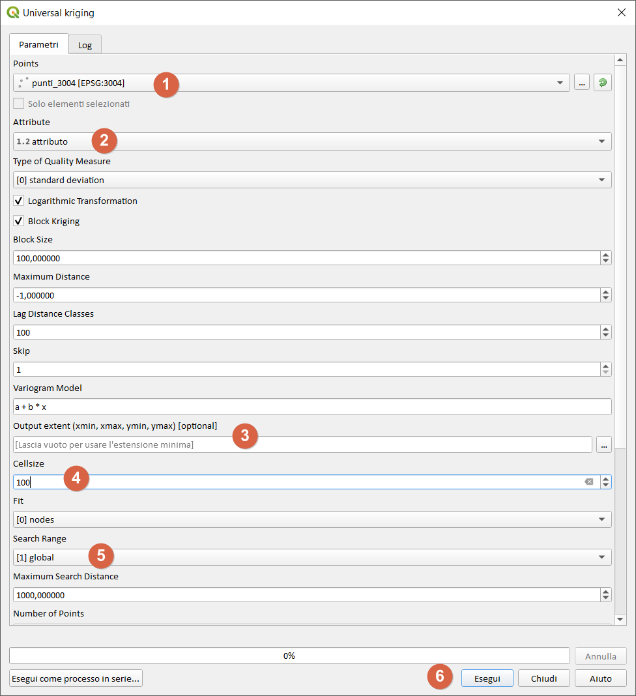
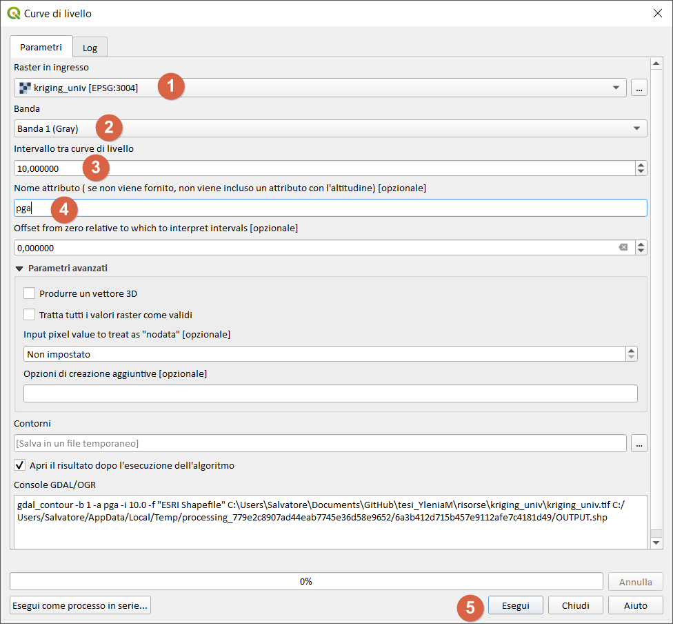

## kriging Universale

È di fondamentale importanza studiare i vari parametri richiesti dal processing [0], sotto uno screenshot dei parametri da me utilizzati:

[0] [Module Universal Kriging SAGA GIS](http://www.saga-gis.org/saga_tool_doc/2.1.3/statistics_kriging_2.html)

## isopga

dato un raster, per estrarre le curve di livello (in questo caso isopga) si utilizza lo strumento _curve di livello_; cercarlo negli strumenti di procesing:

